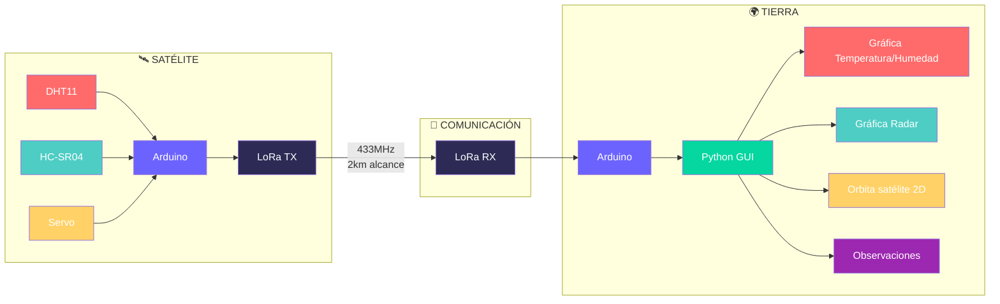

# 🛰️ PROJECTE Grup 15 🛰️

## 👥 Integrantes del Equipo
ASIER                              LUCIA                                MIGUEL

## Descripcion del proyecto 

*CARACTERÍSTICAS PRINCIPALES*
<div align="left">
- Sistema satélite-tierra con comunicación LoRa
  - Tecnología LoRa SX1276 a 433 MHz 
  - Validación de datos mediante checksum
- Sensores integrados en satélite
  - DHT11(sensor) para temperatura y humedad
  - HC-SR04(sensor ultrasonidos) para medición de distancia
  - Servo SG90 para orientación tipo radar
- Interfaz gráfica en tiempo real
  - Desarrollada en Python con Tkinter
  - Visualización de las graficas 
- Protocolo de comunicación estructurado
  - Múltiples tipos de mensaje (temperatura, humedad, distancia)
  - Sistema de control bidireccional
- Sistema de alarmas y validación
  - Detección de 3 medias consecutivas sobre límite en temperatura/humedad
  - Alarmas visuales y auditivas (LEDs y buzzer)
  - Checksum para comprobar los datos

</div>


# Versiones
## Version 1:

Nosaltes durant aquesta versió 1 no hem aconseguit cumplir amb tots els passos inidcats, hem aconseguit fer fins als pas 3, es a dir; hem fet que envïi les dades de temperatura, les rebi l'altre ordinador, i les posi en una gràfica que esta incrustada a una interfaç. Pensem que no hem pogut acabar tots els punts de la versió 1 ja que cap dels 3 pràcticament havia fet servir mai l'Arduino i a les primeres classes vam tenir dificultats però a mesura que hem anat pràcticant ja ens han començat a sortir les coses millor. Per ultim, pensem que hem treballat bastant be però ens ha faltat més comunicació i més coordinació entre nosaltres. Esperem fer-ho millor en les pròximes versions.

VIDEO V1:
https://drive.google.com/file/d/1L8MmuHGUYzk3Fw5PDx3Sk3lThohy9duL/view?usp=drive_link


## Version 2:

En aquest temps hem acabat el que ens faltaba per acabar de la versio 1 i hem començat la versio 2, tot i que encara ens falten bastantes coses i els codis no funcionen amb tot junt. Per aixo en el video nomes surt la versio 1 i el codi del test unitari que tenim de la versio 2 que si que funciona. 
Hem tingut algunes dificultats en ajuntar aquest codis i per aixo com no esta del tot be no hi ha video. Ens assegurarem que per a la versio 3 estara tot fet.

VIDEO V2:
https://drive.google.com/file/d/17cMnbxN7gR1Ks_FBl84Vf93BH628MKZ-/view?usp=sharing

## Version 3:
Tenim tot el que demana menys la gràfica de les òrbites ja que no acaba de surtir be a la interfaç. També com diem en el video ens falta arreglar petites coses de la interfaç i de l'alarma.

Video V2:
https://drive.google.com/file/d/1Vp3Mgnz5NVvSKLzOE6YZtBhTxNeMwWKn/view?usp=sharing


<div align="center">


<br />


<br />

**Sistema de comunicación satélite-tierra con tecnología LoRa**  

[🎥 Videos de las versiones](#-videos-de-las-versiones) · [📡 Protocolo de aplicación](#-protocolo-de-comunicación) · [🏗️ Arquitectura del Sistema](#️-arquitectura-del-sistema) · [📁 Estructura del Proyecto](#-estructura-del-proyecto)

</div>

## 🎥 Videos de las versiones

<div align="center">

| Versión | Video | Estado | Funcionalidades |
|---------|-------|--------|----------------|
| **V1** | [](https://drive.google.com/file/d/1L8MmuHGUYzk3Fw5PDx3Sk3lThohy9duL/view) | ✅ Completado | Comunicación básica + DHT11 |
| **V2** | [](https://drive.google.com/file/d/17cMnbxN7gR1Ks_FBl84Vf93BH628MKZ-/view) | ✅ Completado | Sensor HC-SR04 + Radar |
| **V3** | [](https://drive.google.com/file/d/1Vp3Mgnz5NVvSKLzOE6YZtBhTxNeMwWKn/view) | ✅ Completado | LoRa + Órbita 2D |
| **V4** | [](#) | ✅ Completado | Sistema completo + mejoras |

</div>

## 📡 Protocolo de Comunicación

```
# Formato Satélite→Tierra: 1:temp:hum|2:dist:ang|3:x:y:z|4:alarma|5:media|ORBIT|tiempo:x:y:z|6:ack

-> ack = acknowledgment (confirmación de recepción)
```


## 🏗️ Arquitectura del Sistema



## 👥 Integrantes del Equipo

<div align="center">
<table>
  <tr>
    <td align="center" colspan="3">
      <h3>💻<strong>Los desarrolladores</strong>💻</h3>
    </td>
  </tr>
  <tr>
    <td align="center">
      <strong> Asier Romero</strong><br>
    </td>
    <td align="center">
      <strong> Lucía Vega</strong><br>
    </td>
    <td align="center">
      <strong> Miguel Fernández</strong><br>
    </td>
  </tr>
  <tr>
    <td align="center" colspan="3">
      <em>Grupo 15 - Sistema Satelital</em>
    </td>
  </tr>
</table>
</div>


## 📁 Estructura del Proyecto

```
🌐 SISTEMA_SATELITAL/
├── 🛰️ Codigo_Satelite/
│   ├── ⚡ satelite_final.ino
│   └── 📚 librerias/
│
├── 🌍 Codigo_Estacion_Tierra/
│   ├── ⚡ estacion_tierra_final.ino
│   └── 📚 librerias/
│
├── 🐍 Interfaz_Python/
│   ├── 🎮 interfaz_final.py
│   ├── 📊 graficas.py
│   ├── 📡 comunicacion.py
│   └── 📝 logging_sistema.py
│
├── 🧪 Tests_Unitarios/
│   ├── 🌡️ test_temperatura.ino
│   ├── 📶 test_comunicacion.ino
│   ├── 📏 test_proximidad.ino
│   └️ 🛰️ test_orbita.ino
│
├── 📚 Documentacion/
│   ├── 🔌 esquemas_circuitos.pdf
│   ├── 📡 protocolo_comunicacion.md
│   └️ 📖 manual_usuario.pdf
│
└── 🎥 Media/
    ├── 📐 diagramas/
    ├️ 📸 fotos_montaje/
    └️ 🎬 videos/
```


## 📚 Licencia

<div align="center">

**Licencia Académica**  
Este proyecto se distribuye para fines educativos.  

**© 2025 Grupo 15 - Sistema Satelital**

</div>

---

<div align="center">

**Asignatura:** Ciencias de la computación 
**Institución:** EETAC
**Año académico:** 2025  
**Última actualización:** Diciembre 2025

[⬆️ Volver al inicio](#-sistema-satelital:-grupo-15)

</div>


