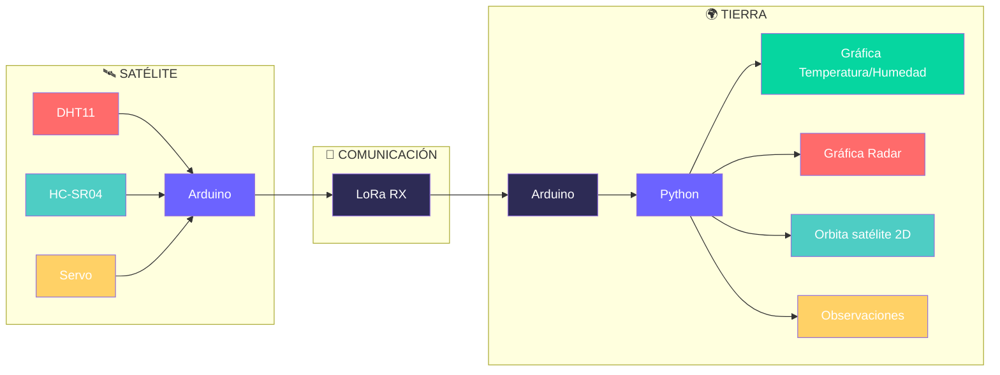

# 🛰️ PROJECTE Grup 15 🛰️

## 👥 Integrantes del Equipo
ASIER  LUCIA                                MIGUEL

## Descripcion del proyecto 

Este proyecto consiste en crear un sistema entre dos arduinos que representa uno la estacion de tierra y el otro el satelite. El objetivo es montar con el kit de arduino y programar un codigo que haga que el satelite capte una serie de datos, los envie a tierra y finalmente que la estacion de tierra los capte y con un codigo en python se pudan mostrar graficas en una interfaz.

**CARACTERÍSTICAS PRINCIPALES**

  
- Sistema satélite-tierra con comunicación LoRa
  - Tecnología LoRa SX1276 a 433 MHz 
- Sensores integrados en satélite
  - DHT11(sensor) para temperatura y humedad
  - HC-SR04(sensor ultrasonidos) para medición de distancia
  - Servo SG90 para orientación tipo radar
- Interfaz gráfica en tiempo real
  - Desarrollada en Python con Tkinter
  - Visualización de las graficas 
- Protocolo de comunicación estructurado
  - Múltiples tipos de mensaje (temperatura, humedad, distancia)
  - Sistema de control bidireccional
- Sistema de alarmas y validación
  - Alarmas visuales y auditivas (LEDs y buzzer)
  

**Estructura del Proyecto**

# Versiones
## Version 1:

Nosotros durante esta versión 1 no hemos conseguido cumplir con todos los pasos indicados, hemos conseguido dar hasta los pasos 3, es decir; hemos hecho que envíe los datos de temperatura, los reciba el otro ordenador, y los ponga en una gráfica que está incrustada en una interfaz. Pensamos que no hemos podido terminar todos los puntos de la versión 1 ya que ninguno de los 3 prácticamente había utilizado nunca Arduino y en las primeras clases tuvimos dificultades pero a medida que hemos ido practicando ya nos han empezado a salir las cosas mejor. Por ultimo, pensamos que hemos trabajado bastante bien pero nos ha faltado más comunicación y más coordinación entre nosotros. Esperamos hacerlo mejor en las próximas versiones.

VIDEO V1:
https://drive.google.com/file/d/1L8MmuHGUYzk3Fw5PDx3Sk3lThohy9duL/view?usp=drive_link

## Version 2:

En este tiempo hemos terminado lo que nos faltaba para acabar de la version 1 y hemos empezado la version 2, aunque todavía nos faltan bastantes cosas y los códigos no funcionan con todo junto. Por eso en el video solo sale la version 1 y el código del test unitario que tenemos de la version 2 que sí funciona. 
Hemos tenido algunas dificultades en juntar estos códigos y por eso como no está del todo bien no esta en el video. Nos aseguraremos que para la version 3 estará todo hecho.

VIDEO V2:
https://drive.google.com/file/d/17cMnbxN7gR1Ks_FBl84Vf93BH628MKZ-/view?usp=sharing

## Version 3:
Tenemos todo lo que menos pide la gráfica de las órbitas ya que no acaba de salir bien en la interfaz. También como decimos en el vídeo, nos falta arreglar pequeñas cosas de la interfaz y de la alarma.

VIDEO V3:
https://drive.google.com/file/d/1Vp3Mgnz5NVvSKLzOE6YZtBhTxNeMwWKn/view?usp=sharing

## Version 4:

Nosotros no hemos podido hacer mucho por esta ultima versión ya que hemos estado casi hasta el ultimo día arreglando pequeños errores de las versiones anteriores que teníamos y que han ido apareciendo a medida que íbamos implementando más cosas. Por tanto, sólo hemos podido hacer una interfaz mejorada, con muchas opciones, más botones y más visual, donde hemos agregado las medias de la humedad.

VIDEO V4:

