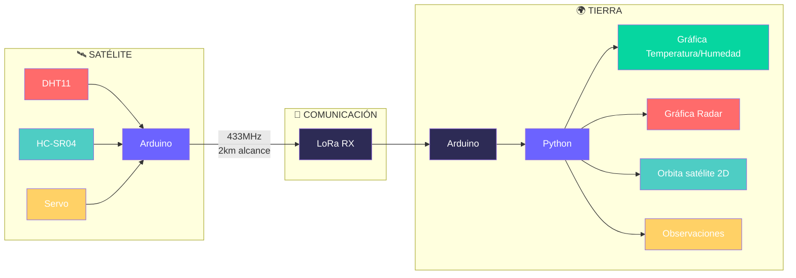

# 🛰️ PROJECTE Grup 15 🛰️

## 👥 Integrantes del Equipo
ASIER  LUCIA                                MIGUEL

## Descripcion del proyecto 

Este proyecto consiste en crear un sistema entre dos arduinos que representa uno la estacion de tierra y el otro el satelite. El objetivo es montar con el kit de arduino y programar un codigo que haga que el satelite capte una serie de datos, los envie a tierra y finalmente que la estacion de tierra los capte y con un codigo en python se pudan mostrar graficas en una interfaz.

**CARACTERÍSTICAS PRINCIPALES**

  
- Sistema satélite-tierra con comunicación LoRa
  - Tecnología LoRa SX1276 a 433 MHz 
- Sensores integrados en satélite
  - DHT11(sensor) para temperatura y humedad
  - HC-SR04(sensor ultrasonidos) para medición de distancia
  - Servo SG90 para orientación tipo radar
- Interfaz gráfica en tiempo real
  - Desarrollada en Python con Tkinter
  - Visualización de las graficas 
- Protocolo de comunicación estructurado
  - Múltiples tipos de mensaje (temperatura, humedad, distancia)
  - Sistema de control bidireccional
- Sistema de alarmas y validación
  - Alarmas visuales y auditivas (LEDs y buzzer)
  

# Versiones
## Version 1:

Nosaltes durant aquesta versió 1 no hem aconseguit cumplir amb tots els passos inidcats, hem aconseguit fer fins als pas 3, es a dir; hem fet que envïi les dades de temperatura, les rebi l'altre ordinador, i les posi en una gràfica que esta incrustada a una interfaç. Pensem que no hem pogut acabar tots els punts de la versió 1 ja que cap dels 3 pràcticament havia fet servir mai l'Arduino i a les primeres classes vam tenir dificultats però a mesura que hem anat pràcticant ja ens han començat a sortir les coses millor. Per ultim, pensem que hem treballat bastant be però ens ha faltat més comunicació i més coordinació entre nosaltres. Esperem fer-ho millor en les pròximes versions.

VIDEO V1:
https://drive.google.com/file/d/1L8MmuHGUYzk3Fw5PDx3Sk3lThohy9duL/view?usp=drive_link

## Version 2:

En aquest temps hem acabat el que ens faltaba per acabar de la versio 1 i hem començat la versio 2, tot i que encara ens falten bastantes coses i els codis no funcionen amb tot junt. Per aixo en el video nomes surt la versio 1 i el codi del test unitari que tenim de la versio 2 que si que funciona. 
Hem tingut algunes dificultats en ajuntar aquest codis i per aixo com no esta del tot be no hi ha video. Ens assegurarem que per a la versio 3 estara tot fet.

VIDEO V2:
https://drive.google.com/file/d/17cMnbxN7gR1Ks_FBl84Vf93BH628MKZ-/view?usp=sharing

## Version 3:
Tenim tot el que demana menys la gràfica de les òrbites ja que no acaba de surtir be a la interfaç. També com diem en el video ens falta arreglar petites coses de la interfaç i de l'alarma.

VIDEO V3:
https://drive.google.com/file/d/1Vp3Mgnz5NVvSKLzOE6YZtBhTxNeMwWKn/view?usp=sharing

## Version 4:

Nosaltres no hem pogut fer gaire cosa per aquesta ultima versió ja que hem estat quasi fins l'ultim dia hem estat arreglant petits errors de les versions anteriors que teniem i que han anat apareixen a mesura que anavem implementant mes coses. Per tant, nomes hem pogut fer una interfaç millorada, amb moltes opcions, mes botons i més visual, on hem agegit les mitjanes de la humitat. 

VIDEO V4:

**Estructura del Proyecto**

